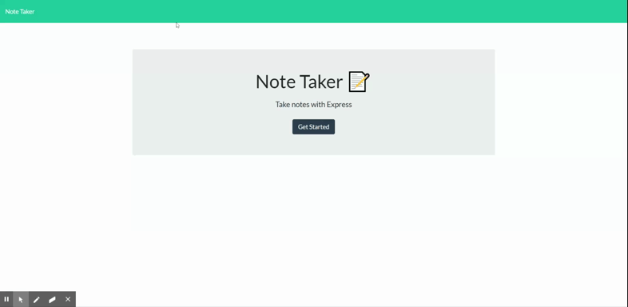

# Note-Taking-App

## Description
This is a note taking app. It takes user inputs and creates note objects and stores them in db.json. You can delete notes with the delete button next to the note and it will update the database, removing the note, and re-display the db.json without the deleted note.

## Dependencies
    express
    
## Installation
```
npm install
```

## Testing
```
no tests
```

## Demo

